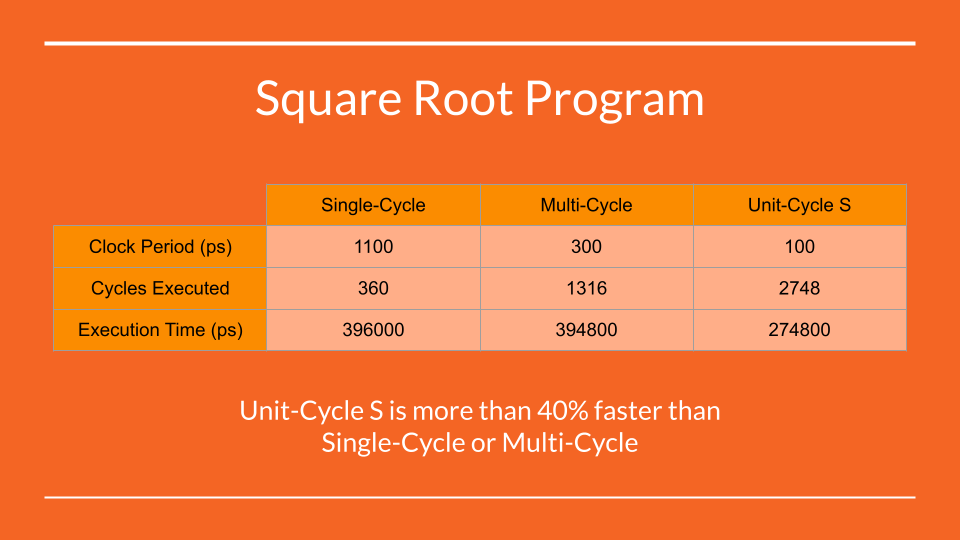

# Unit-Cycle

We are developing unit-cycle, a new micro-architecture to reduce wasted
instruction time in processors. So far, we have a small table of simulated
results, showing unit-cycle's performance against single-cycle and multi-cycle:

